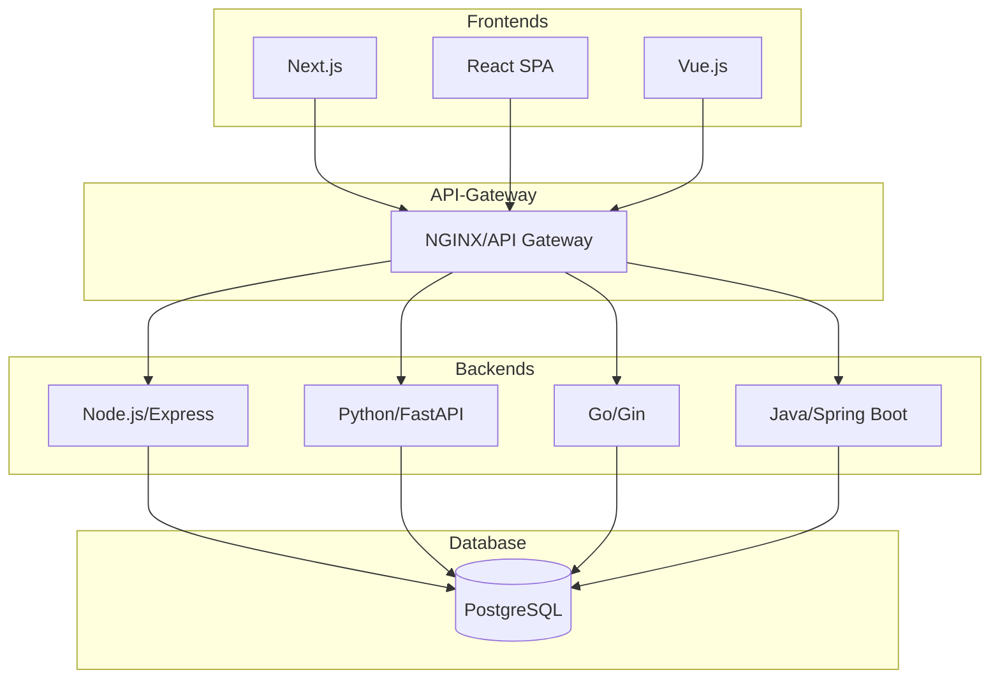

# HabitCraft - Full Stack Learning Project

A polyglot habit tracking application built with multiple technology stacks for learning and portfolio purposes.

## Project Overview

This repository demonstrates the implementation of HabitCraft using different programming languages and frameworks. Each variant follows the same API specification and data model, making it easy to mix and match frontends with backends.

## Project Structure

```
habittracker_fullstack/
├── backends/              # API implementations in different languages
│   ├── node/             # Node.js + Express (TypeScript/JavaScript)
│   ├── python/           # Python + FastAPI/Flask
│   ├── golang/           # Go + Gin/Echo
│   └── java/             # Java + Spring Boot
├── frontends/            # UI implementations in different frameworks
│   ├── nextjs/           # Next.js (React framework)
│   ├── react/            # React SPA
│   └── vue/              # Vue.js
├── infrastructure/       # Deployment and infrastructure as code
│   └── terraform/        # Terraform configurations
├── shared/               # Shared resources across all implementations
│   ├── api-spec/         # OpenAPI/Swagger specifications
│   ├── database/         # Database schemas and migrations
│   └── types/            # Shared type definitions
└── docker-compose.yml    # Orchestration for all services
```

## Features

The HabitCraft application includes:

- User authentication and authorization
- Create, read, update, delete (CRUD) habits
- Track daily habit completion
- View habit statistics and streaks
- Responsive UI design

## Getting Started

### Prerequisites

Depending on which stack you want to run:

- **Node.js**: Node.js 18+ and npm
- **Python**: Python 3.10+
- **Go**: Go 1.21+
- **Java**: JDK 17+
- **Docker**: Docker and Docker Compose (recommended)

### Quick Start with Docker

Run any combination of backend and frontend:

```bash
# Start Node.js backend + Next.js frontend
docker-compose up backend-node frontend-nextjs

# Start Python backend + Vue frontend
docker-compose up backend-python frontend-vue

# Start all services
docker-compose up
```

### Manual Setup

Each backend and frontend has its own README with specific setup instructions:

- [Node.js Backend](./backends/node/README.md)
- [Python Backend](./backends/python/README.md)
- [Go Backend](./backends/golang/README.md)
- [Java Backend](./backends/java/README.md)
- [Next.js Frontend](./frontends/nextjs/README.md)
- [React Frontend](./frontends/react/README.md)
- [Vue Frontend](./frontends/vue/README.md)

## API Documentation

All backends implement the same REST API specification defined in [shared/api-spec/openapi.yaml](./shared/api-spec/openapi.yaml).

Interactive API documentation is available when running any backend:
- Swagger UI: `http://localhost:3000/api-docs`

## Database

The application uses PostgreSQL. Schema and migrations are available in [shared/database/](./shared/database/).

## Technology Stack

### Backends

| Language | Framework | ORM/Database | Testing | Status |
|----------|-----------|--------------|---------|--------|
| Node.js  | Express   | Prisma/TypeORM | Jest + Supertest | ✅ In Progress |
| Python   | FastAPI   | SQLAlchemy   | Pytest | 🔜 Planned |
| Go       | Gin       | GORM         | testing | 🔜 Planned |
| Java     | Spring Boot | JPA/Hibernate | JUnit | 🔜 Planned |

### Frontends

| Framework | State Management | Styling | Testing | Status |
|-----------|-----------------|---------|---------|--------|
| Next.js   | React Hooks     | Tailwind CSS | Jest + RTL | ✅ Complete |
| React     | Redux/Zustand   | Styled Components | Jest + RTL | 🔜 Planned |
| Vue       | Pinia           | Tailwind CSS | Vitest | 🔜 Planned |

## Development Approach

Each implementation follows:

- **Test-Driven Development (TDD)** where applicable
- **Clean Architecture** principles
- **RESTful API** design
- **OpenAPI** specification compliance
- **Docker** containerization

## Learning Goals

This project demonstrates understanding of:

1. Multiple programming paradigms (OOP, functional, etc.)
2. Different web frameworks and their ecosystems
3. API design and implementation consistency
4. Frontend framework differences and similarities
5. Containerization and orchestration
6. Infrastructure as Code
7. Testing strategies across languages

## Contributing

This is a personal learning project, but suggestions and feedback are welcome! Please open an issue to discuss proposed changes.

## License

MIT License - feel free to use this for your own learning!

## Roadmap

### Backend - Node.js
- [x] Hello World API with TDD
- [x] Database connection and configuration
- [x] Mock authentication (X-User-Id header)
- [x] Habit Create endpoint (POST /api/v1/habits)
- [x] Habit Read endpoint (GET /api/v1/habits)
- [ ] Habit Update endpoint (PUT /api/v1/habits/:id)
- [x] Habit Delete endpoint (DELETE /api/v1/habits/:id)
- [x] Completions tracking (Create, Read, Delete)
- [ ] JWT authentication
- [ ] Statistics endpoint

### Frontend - Next.js
- [x] Full implementation with API integration
- [x] Habit display and creation
- [x] Completion tracking

### Other Backends
- [ ] Python backend implementation
- [ ] Go backend implementation
- [ ] Java backend implementation

### Other Frontends
- [ ] React SPA implementation
- [ ] Vue.js implementation

### Infrastructure
- [ ] Docker Compose configuration
- [ ] CI/CD pipelines
- [ ] Terraform infrastructure
- [ ] Kubernetes deployment configurations

## Architecture Diagram



## Contact

Built by [Your Name] as a learning and portfolio project.

---

**Note**: This is a learning project. Each implementation may be at different stages of completion. Check individual README files for current status.
